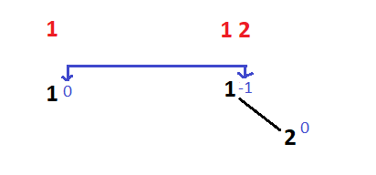
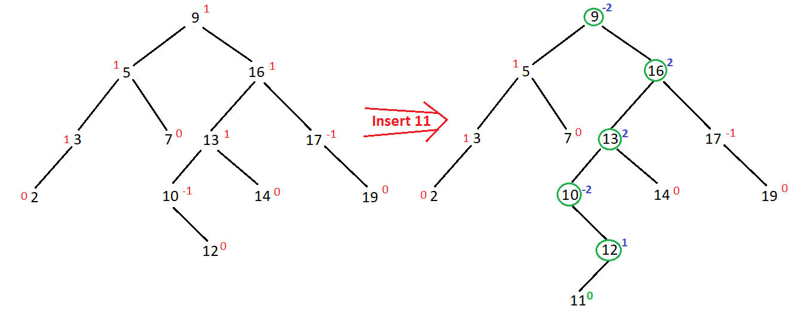
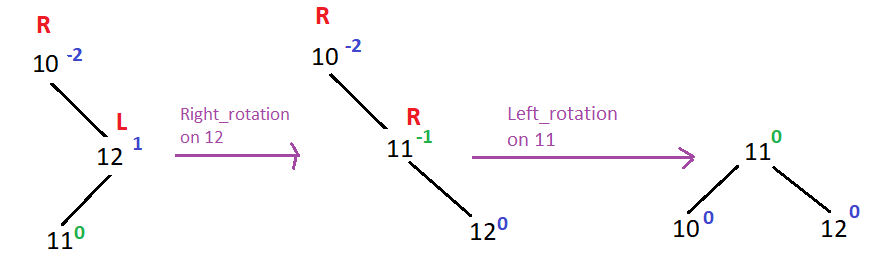
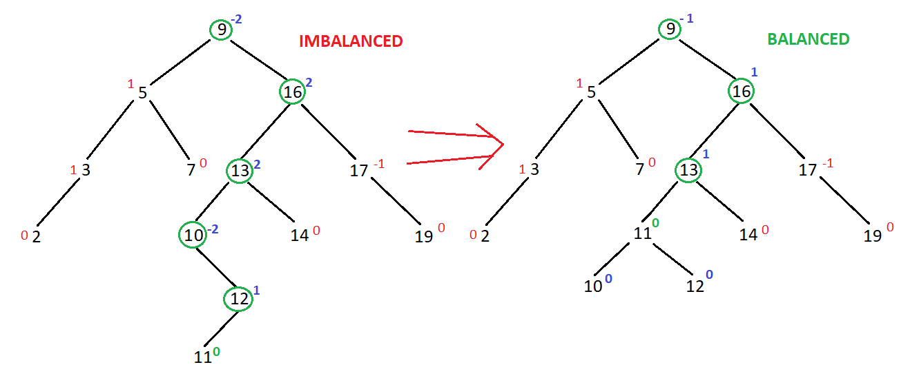
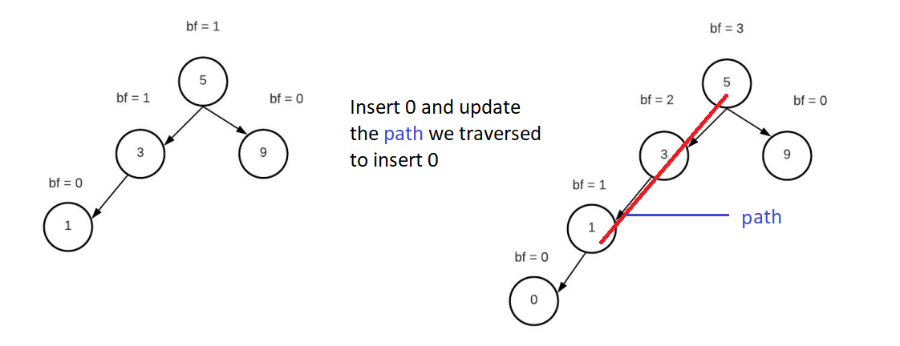
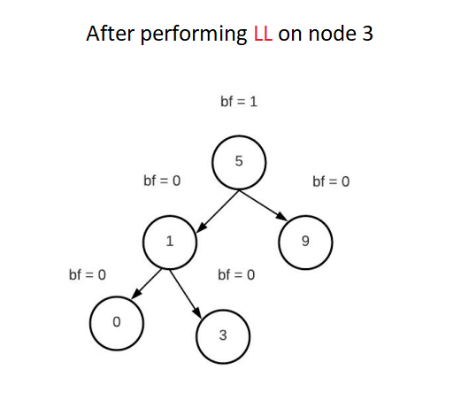

1. Watch [first](https://youtu.be/jDM6_TnYIqE?si=EoVUw2AIFzvtLA3k) and [then](https://youtu.be/bBIhFbvavLk?si=zDFWoXJBNT3bXLym)
2. So `To Rotate we need at least 3 nodes!`

# Insertion



- - Here when we added 2, we can see 1's balance factor changed. So for a BST Tree with 2 nodes, we don't need to rotate but we need to `update the height and balance factor` always, not for leaf nodes`(as their height = 0 always BEFORE AND AFTER INSERTING)` but overall ALWAYS update the heights and balance factors for every nodes.
3. AVL Tree is a BST but DENSED! Now to insert a Node in any kind of BST, insert it in normal BST way at first.



- - Here at the left an AVL Tree already existing where `red numbers are Balance Factors for each node`. After inserting 11 in normal BST way we can see that `the path which we had to traverse to insert 11 at the end of that path, only that path's all node's balance factors CHANGED!`, ALL OTHER BALANCE FACTORS except that path is UNCHANGED!
- - So, after inserting 11, go back to 12 and its UNCHANGED, so go back to 10 and 10'S BF = -2 means
```js
Length of 10.right subtree BIGGER THAN 10.left subtree which denoting that I HAVE BIGGER SUBTREE AT MY "RIGHT" which causing the IMBALANCE! So I have to RIGHT_ROTATION at Node 10! Now at 10."RIGHT", BF of 12 = 1 denoting I HAVE BIGGER SUBTREE AT MY "LEFT".. So This is "RIGHT LEFT (RL)" case.

when its RL, we have to convert it to RR. Similary for LR, we have to convert it to LL.
```


```js
R'L'    =>      R'R'

Since 'L' on Node 12 and we have to convert 'L' to 'R', that means we have to perform 'R'IGHT_ROTATION on 12!
After converting to RR, just simply perform LEFT_ROTATION now on Root Node 10 where the BF  = -2.

OBSERVE : We are needing mainly 3 nodes to do the rotation but when we did right_rotation on 12, we needed to rotate only 12 and 11.
          Similarly when we performed left_rotation on node 10, we needed to rotate only 10 and 11.
So, TO PERFORM ROTATION, we need 3 NODES. But when we PERFORM left/right rotation, we are only needing 2 NODES.
```
4. Now :



- So 10's BF was -2, after performing ROTATION, we placed the new sub tree at 13.left where 10 was. No go back to 13 and after updating 13's BF from 2 to 1, we see root 13 its balanced. So go back 16 and update it's BF from 2 to 1 which is okay. Go back 9 and its updated BF = -1 which is okay too.

## Summary for Insertion
```js
From root we go to the node 'x' on whose left or right, the new node will be inserted. After inserting the new node at x's left or right', we update the 'height and balance factor of x', if the UPDATED_BALANCE_FACTOR is 2 or -2, we perform ROTATION on 'x', then we go back to the node which called 'x' and update its height and balance factor and perform rotation if needed and we keep doing it till the root node.

It sounds like a Recursion where at first we keep recursion and go to node 'x' and say x.left/right = new_node. Now before going back to the caller function node 'y', below 'the recursion line', we update height and balance factor of node 'x' and return the new_root(new subtree generated after rotation) if ROTATION performed, else the current node TO THE CALLEr FUNCTION node 'y'.
```

Code
```py
    def insert_node(self,  root: TreeNode, key: int) -> TreeNode:
        # step 1 : Insert the Node in normal BST way
        if root == None:
            return TreeNode(key)
        
        if key < root.val:
            root.left  = self.insert_node(root.left,  key)
        else:
            root.right = self.insert_node(root.right, key)
                                                                            # After recursion stops going further, step 2 to 4 will run.
        # step 2 : Balance the Node / current root and return the new root
        return self.balance_curRoot_and_returnNewRoot(root)
```
- `balance_curRoot_and_returnNewRoot(root)` here we update height and balance factor of the `current root` and then If ROTATION needed, after performing rotation we return the new root, else the `current root` itself.

## balance factor can be 3, -3 or maybe more.




- After inserting 0 : For Node 3, BF = 2 and for Node 5, BF = 3. 
- After performing `LL` on Node 3 : Now go back to Node 5 and update its height and BF and now BF = 1 from 3 denoting no rotation is needed for Node 5. So when an IMBALANCE happens, at first it is `2 or -2`. Then when we perform on rotation on that IMBALANCED NODE, the BF becomes < 2, causing OTHER IMBALANCED NODE's BF to reduce from its old BF. Yeah you might need rotation on other imbalanced node as well. That's why we keep update height, BF of other node as well (other node = Nodes on the Traversed Path) and check if rotation needed.

```js
Time  Complexity : O(logn)
Space Complexity : O(logn)
```