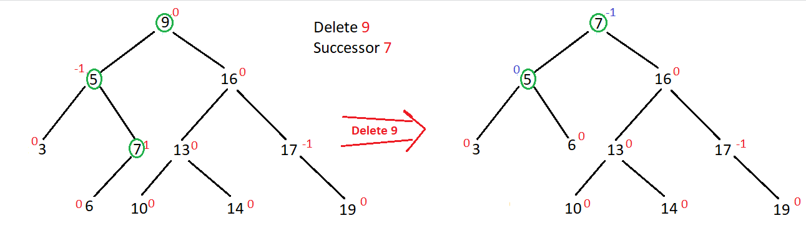
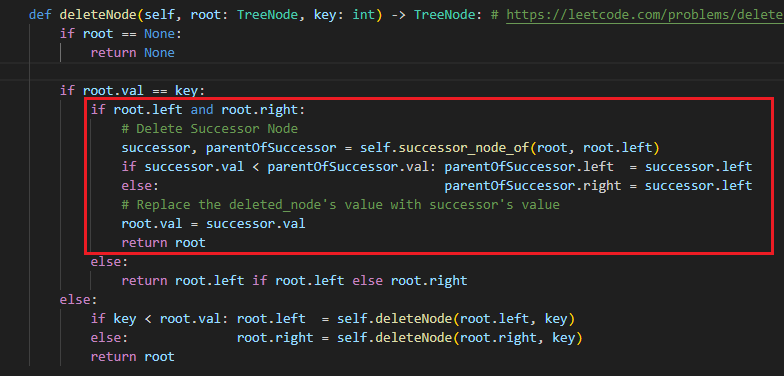
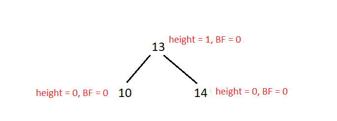

1. Watch [first](https://youtu.be/jDM6_TnYIqE?si=EoVUw2AIFzvtLA3k) and [then](https://youtu.be/bBIhFbvavLk?si=zDFWoXJBNT3bXLym)
2. So `To Rotate we need at least 3 nodes!`

# Insertion


- - Here when we added 2, we can see 1's balance factor changed. So for a BST Tree with 2 nodes, we don't need to rotate but we need to `update the height and balance factor` always, not for leaf nodes`(as their height = 0 always BEFORE AND AFTER INSERTING)` but overall ALWAYS update the heights and balance factors for every nodes.
3. AVL Tree is a BST but DENSED! Now to insert a Node in any kind of BST, insert it in normal BST way at first.


- - Here at the left an AVL Tree already existing where `red numbers are Balance Factors for each node`. After inserting 11 in normal BST way we can see that `the path which we had to traverse to insert 11 at the end of that path, only that path's all node's balance factors CHANGED!`, ALL OTHER BALANCE FACTORS except that path is UNCHANGED!
- - So, after inserting 11, go back to 12 and its UNCHANGED, so go back to 10 and 10'S BF = -2 means
```js
Length of 10.right subtree BIGGER THAN 10.left subtree which denoting that I HAVE BIGGER SUBTREE AT MY "RIGHT" which causing
the IMBALANCE! So I have to RIGHT_ROTATION at Node 10! Now at 10."RIGHT", BF of 12 = 1 denoting I HAVE BIGGER SUBTREE AT MY
"LEFT".. So This is "RIGHT LEFT (RL)" case.

when its RL, we have to convert it to RR. Similary for LR, we have to convert it to LL.
```


```js
R'L'    =>      R'R'

Since 'L' on Node 12 and we have to convert 'L' to 'R', that means we have to perform 'R'IGHT_ROTATION on 12!
After converting to RR, just simply perform LEFT_ROTATION now on Root Node 10 where the BF  = -2.

OBSERVE : We are needing mainly 3 nodes to do the rotation but when we did right_rotation on 12, we needed to rotate only 12
          and 11.
          Similarly when we performed left_rotation on node 10, we needed to rotate only 10 and 11.
So, TO PERFORM ROTATION, we need 3 NODES. But when we PERFORM left/right rotation, we are only needing 2 NODES.
```
4. Now :


- So 10's BF was -2, after performing ROTATION, we placed the new sub tree at 13.left where 10 was. No go back to 13 and after updating 13's BF from 2 to 1, we see root 13 its balanced. So go back 16 and update it's BF from 2 to 1 which is okay. Go back 9 and its updated BF = -1 which is okay too.

## Summary for Insertion
```js
From root we go to the node 'x' on whose left or right, the new node will be inserted. After inserting the new node at x's
left or right', we update the 'height and balance factor of x', if the UPDATED_BALANCE_FACTOR is 2 or -2, we perform ROTATION
on 'x', then we go back to the node which called 'x' and update its height and balance factor and perform rotation if needed
and we keep doing it till the root node.

It sounds like a Recursion where at first we keep recursion and go to node 'x' and say x.left/right = new_node. Now before 
going back to the caller function node 'y', below 'the recursion line', we update height and balance factor of node 'x' and
return the new_root(new subtree generated after rotation) if ROTATION performed, else the current node TO THE CALLEr FUNCTION
node 'y'.
```

## Code
```py
    def insert_node(self,  root: TreeNode, key: int) -> TreeNode:
        # step 1 : Insert the Node in normal BST way
        if root == None:
            return TreeNode(key)
        
        if key < root.val:
            root.left  = self.insert_node(root.left,  key)
        else:
            root.right = self.insert_node(root.right, key)
                                                                    
        # step 2 : Balance the Node / current root and return the new root to the caller function.
        return self.balance_curRoot_and_returnNewRoot(root)
```
- `balance_curRoot_and_returnNewRoot(root)` here we update height and balance factor of the `current root` and then If ROTATION needed, after performing rotation we return the new root, else the `current root` itself.

## balance factor can be 3, -3 or maybe more.


- After inserting 0 : For Node 3, BF = 2 and for Node 5, BF = 3. 
- After performing `LL` on Node 3 : Now go back to Node 5 and update its height and BF and now BF = 1 from 3 denoting no rotation is needed for Node 5. So when an IMBALANCE happens, at first it is `2 or -2`. Then when we perform on rotation on that IMBALANCED NODE, the BF becomes < 2, causing OTHER IMBALANCED NODE's BF to reduce from its old BF `(like for nodes with BF 3 to 2 or < 2)` and that's the reason we will always do `if current node's updated BF == 2 or -2, then perform rotation`. So you might need rotation on other imbalanced node as well. That's why we keep updating height, BF of other node as well (other node = Nodes on the Traversed Path only) and check if rotation needed.

```js
Time  Complexity : O(logn)
Space Complexity : O(logn)
```

# Deletion

- At first read [Deletion in BST (Second Solution)](https://leetcode.com/problems/delete-node-in-a-bst/solutions/5115570/with-explanation)
1. As you can see that, if `keyNode has both left and right subtree`, we need to find the `successor`. For example :



- Here to delete Node `9`, we had to TRAVERSE FROM ROOT TO SUCCESSOR in total, so the `Traverse Path` : `9 -> 5 -> 7`. After deleting 9, only `Node 7 and 5`'s BF is changed means `only Nodes from the Traverse Path need to be updated`, others are unchanged.
- - 6's BF didn't change, not because its leaf node, because 6's BF will be changed if the deletion or insertion happens in the Subtree of 6.



- The `Red Box` is executed when `keyNode has both left and right subtree`, here we've separate function (`successor_node_of(root..`) to find the `successor` means in this `Recursion of deleteNode() function` we don't actually traverse RECURSIVELY till the `keyNode`, we traverse only to the `keyNode` itself. But we've to go till the `keyNode RECURSIVELY TO UPDATE BF of all the nodes in the Traverse Path`. So at the last line of `return root`, we will say `okay now traverse the left subtree of the keyNode and go till the successor node recursively` by `self.deleteNode(root.left, key)`


- So from `keyNode 9`, if we go left i.e. `5`, then this `self.deleteNode(root.left, key)` function will go eventually to `successor, 7` to find `keyNode 9`. That's how we can go to where successor node was RECURSIVELY.. Now before the recursion function will go back one by one to its FIRST function call, root node, we will update the BF of `nodes in the Traverse Path` and apply rotation if required.
2. When the keyNode doen't have either left or right subtree or nothing, then the `Traverse Path` is the path `we traverse to go to keyNode to delete it`. 

## Code
```py
    def deleteNode(self, root: TreeNode, key: int) -> TreeNode: # same as Deletion of BST except the balance...() part
        # step 1 : Delete the Node
        if root == None:
            return None
        
        if root.val == key:
            if root.left and root.right:
                # Delete Successor Node
                successor, parentOfSuccessor = self.successor_node_of(root, root.left)
                if successor.val < parentOfSuccessor.val: parentOfSuccessor.left  = successor.left
                else:                                     parentOfSuccessor.right = successor.left
                # Replace the deleted_node's value with successor's value
                root.val = successor.val
                self.deleteNode(root.left, key) # traverse to where the successor node was 
            else:
                root = root.left if root.left else root.right
        else:
            if key < root.val: root.left  = self.deleteNode(root.left,  key)
            else:              root.right = self.deleteNode(root.right, key)
        
        # step 2 : After Deletion, update height, BF and rotate_if_necessary for EACH NODE in the TRAVERSE PATH
        return self.balance_curRoot_and_returnNewRoot(root)
```

- We only return at the Base Case and at the END OF THE RECURSION FUNCTION because we have to return the `balance_curRoot_and_returnNewRoot(root)` version, not `root` version where BF can be imbalanced.

```js
Time  Complexity : O(logn)
Space Complexity : O(logn)
```

## Sometimes a node's height and BF gets recomputed but the value remains unchanged.



- `root = 13`, lets do `balance_curRoot_and_returnNewRoot(root)` even though in the image `height and BF` are already computed.
```js
    Leaf Node's intitial height = 0

    // step 1 : update the height of the current root
    root.height = 1 + max(self.get_height(root.left), self.get_height(root.right))
                = 1 + max(0, 0)
                = 1 + 0
    13.height   = 1
    
    // step 2 : update the Balance Factor of the current root
    root.balance_factor = self.get_height(root.left) - self.get_height(root.right)
                        = 0 - 0
    13.balance_factor   = 0

    So 13.height and 13.balance_factor remained UNCHANGED! That's why we don't have to worry if a node's height and balance
    factor getting recomputed even after the node is already balanced.
```

## The Whole Code written in the `AVL Tree.py` file.