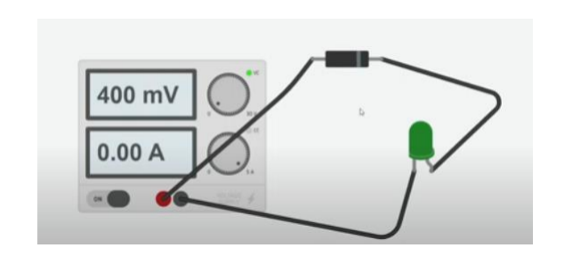
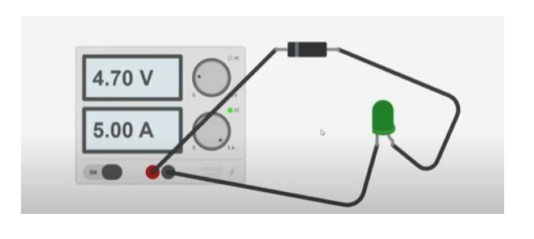
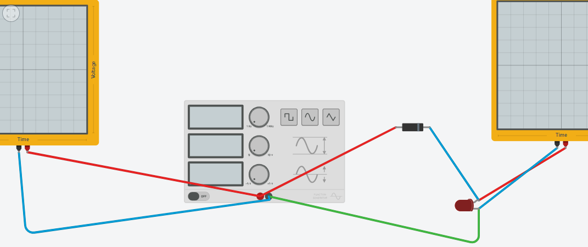
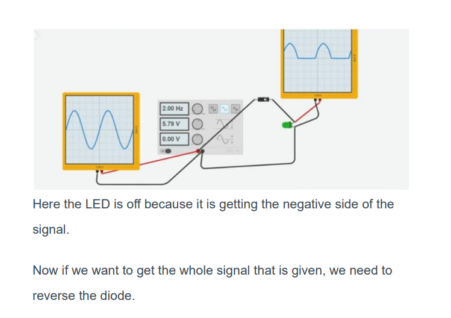
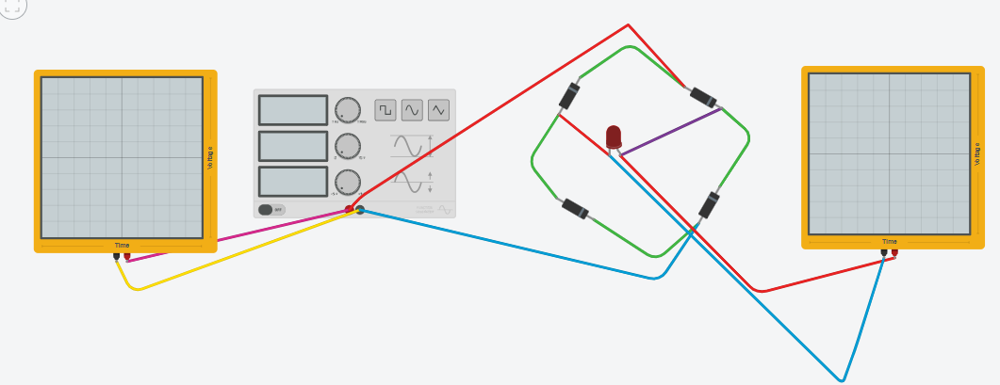
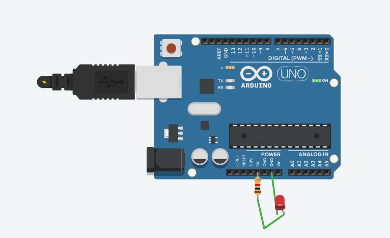
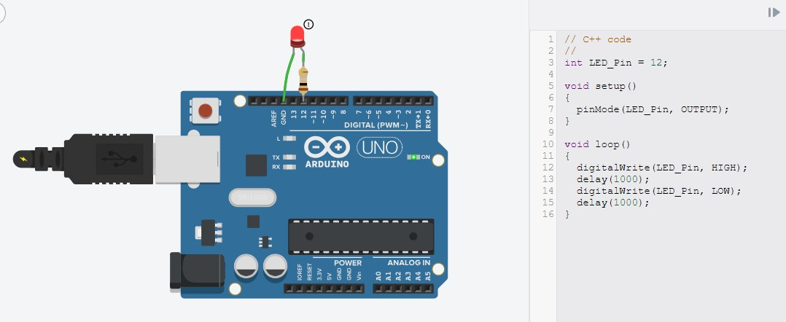
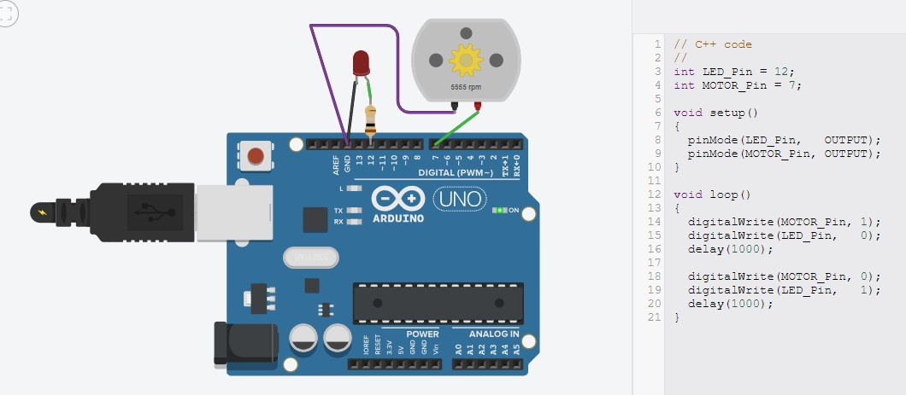
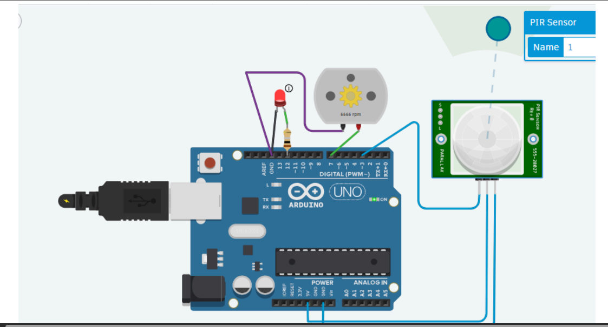
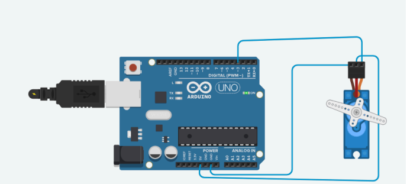

# Resistor 
- A resistor is an electrical component that limits or regulates
the flow of electrical current in an electronic circuit

# Oscilloscope
- An Oscilloscope is an electronic test instrument that displays the
graphical representation of electrical signals and shows how
those signals change over time

# Function Generator
- A function generator can produce :
- - different types of voltage.
- - different shapes of voltage.
- It can also produce the desired shape of the desired
frequency which can be sine wave, square wave or triangle
wave etc

# Diode
- A diode is a specialized electronic component with two electrodes
called the anode and the cathode.It’s a two terminal electronic
component that conducts electricity primarily in one direction and
it also helps to transform AC into DC.

# LED
- A light-emitting diode (LED) is a semiconductor device that emits
light when an electric current flows through it.

# Forward Bias



# Reverse Bias


# Half Wave Rectifier
- Forward Bias : light will blink


- Reverse Bias : light won't blink


# Full Wave Rectifier
1. A full wave bridge rectifier is a type of rectifier that converts
alternating current (AC) to direct current (DC).
2. A bridge rectifier uses four diodes to form a close-loop
bridge. The diodes conduct in pairs through each positive
and negative half cycle, leading to no wastage of power.
3. When the AC input is positive, two of the diodes are
forward biased (current can flow through them), while
the other two diodes are reversed biased (current is
blocked). The current flows through the “allowed path”,
across the load and back into the circuit.
4. When the AC input becomes negative, the other two diodes
switch roles. The previously blocked diodes now allow
current to flow, while the other two become blocked. Since
the diodes are arranged cleverly, the current still flows in the
same direction across the load.
5. The output is no longer a sign wave like the AC. It is now a
series of positive humps, which is much closer to the steady
DC electronics need



# Code :








```cpp
int LED_Pin = 12;
int MOTOR_Pin = 7;
int SENSOR_Pin = 3;

void setup()
{
    pinMode(SENSOR_Pin, INPUT);
    pinMode(LED_Pin, OUTPUT);
    pinMode(MOTOR_Pin, OUTPUT);
}

void loop()
{
    if ( digitalRead(SENSOR_Pin) == 1 )
    {
        digitalWrite(MOTOR_Pin, 1);
        digitalWrite(LED_Pin, 1);
        delay(100000);
    }
    else
    {
        (MOTOR_Pin, 0);
        digitalWrite(LED_Pin, 0);
    }
}
```


```cpp
#include<Servo.h>
int SERVO_Pin = 3;
Servo myServo;

void setup()
{
    myServo.attach(SERVO_Pin);
}

void loop()
{
    for(int pos = 0; pos < 181; pos++)
        myServo.write(pos), delay(5);
    for(int pos = 180; pos > -1; pos--)
        myServo.write(pos), delay(10);
}
```
